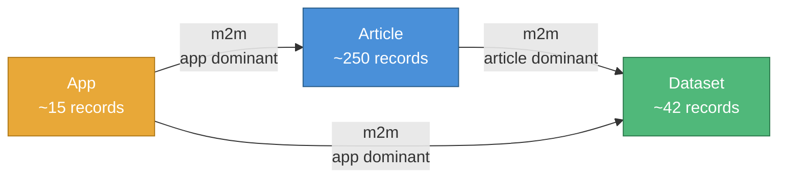

# ResearchHub CMS Migration (Strapi 3 → Strapi 5)

**Project:** ResearchHub Content Migration
**Team:** ICJIA Development Team
**Date:** March 2026
**Version:** 2.5.0 ([Changelog](CHANGELOG.md))

---

## Overview

ResearchHub is ICJIA's platform for publishing research articles, datasets, and data dashboards. This project migrates ResearchHub's content management system from Strapi 3 (MongoDB) to Strapi 5 (SQLite).

Strapi 3 reached end of life in 2022 and no longer receives security patches or compatibility updates. Strapi 5 runs on SQLite, reducing infrastructure complexity and hosting costs while restoring active security and feature support.

## Migration Approach

We use an **API-to-API transfer** rather than direct database conversion:

1. **Read** all content from Strapi 3 via its GraphQL API
2. **Transform** content to match Strapi 5's format, including extracting Base64-encoded images from article and app fields into proper media library files
3. **Write** transformed content into Strapi 5 via its REST API
4. **Verify** completeness and correctness with automated gate checks at every phase

## Content Scope

| Content Type | Count | Complexity | Key Challenges |
|---|---|---|---|
| Articles | ~250 | High | `splash` + `thumbnail` (Base64), inline images in `markdown`, `mainfile`/`extrafile` (upload plugin), 2 m2m relations |
| Datasets | ~42 | Medium | `datafile` (upload plugin), multiple JSON metadata fields, 2 non-dominant m2m relations |
| Apps (Dashboards) | ~15 | Medium | `image` (Base64), 2 dominant m2m relations to articles and datasets |

### Relation Graph

All three content types are interconnected in a triangle:



> **Dominant side** owns the join table and is responsible for linking relations during Phase 4. Arrows point from dominant → non-dominant.

## Project Phases

| Phase | Description | Est. Effort |
|---|---|---|
| 1. Schema Setup | Introspect Strapi 3 schema, generate Strapi 5 content types | 1–2 days |
| 2. Data Extraction | Pull all content from Strapi 3 into local JSON files | 1 day |
| 3. Image & Media Migration | Extract Base64 images, upload media files, rewrite references | 2–3 days |
| 4. Content Loading | Load transformed content into Strapi 5, link relations, restore timestamps | 1–2 days |
| 5. Validation | Automated pass/fail verification of migration completeness | 1–2 days |
| 6. Parity Audit | Field-by-field comparison of every record in Strapi 3 vs Strapi 5 | 1 day |

**Total estimated effort:** 8–12 working days (single developer, sequential phases).

## Documentation

Detailed documentation for every aspect of this migration is available in the [`docs/`](docs/) directory:

- **Executive Summary** — High-level overview for project stakeholders and management: [Markdown](docs/researchhub-migration-executive-summary.md) | [Word (.docx)](https://github.com/ICJIA/hub-cms-migration-2026/raw/main/docs/researchhub-migration-executive-summary.docx)
- **[Doc 00 — Master Design](docs/researchhub-migration-doc00.md)** — Full technical architecture: API-to-API approach, data model mapping, Base64 extraction strategy, relation triangle, and end-to-end migration pipeline
- **[Doc 01 — Phase 1: Introspection & Schema Generation](docs/researchhub-migration-doc01.md)** — Strapi 3 schema discovery and Strapi 5 content type generation
- **[Doc 02 — Phase 2: Data Extraction](docs/researchhub-migration-doc02.md)** — GraphQL-based content extraction to local JSON files
- **[Doc 03 — Phase 3: Base64 Extraction & Media Migration](docs/researchhub-migration-doc03.md)** — Image decoding, media library upload, and content rewriting
- **[Doc 04 — Phase 4: Data Loading & Timestamp Restoration](docs/researchhub-migration-doc04.md)** — Content loading via REST API, relation triangle linking, and timestamp correction
- **[Doc 05 — Phase 5: Validation & Reconciliation](docs/researchhub-migration-doc05.md)** — Automated verification checks and migration integrity report
- **[Doc 06 — Phase 6: Parity Audit](docs/researchhub-migration-doc06.md)** — Field-by-field comparison of every record; detailed audit report with ERROR/EXPECTED/INFO categories
- **[Strapi 5 Setup Guide](docs/STRAPI5-SETUP.md)** — Fresh Strapi 5 installation, PM2 + Nginx configuration, Laravel Forge deployment

### Strapi 3 Schemas

The actual Strapi 3 model schemas are stored in [`schemas/`](schemas/) for reference:

- [`article.settings.json`](schemas/article.settings.json) — 16 scalar fields, 2 upload-plugin media fields, 2 m2m relations
- [`dataset.settings.json`](schemas/dataset.settings.json) — 14 scalar fields, 1 upload-plugin media field, 2 m2m relations
- [`app.settings.json`](schemas/app.settings.json) — 12 scalar fields, 2 m2m relations (both dominant)

## Getting Started

### Platform Support

| Platform | Status | Notes |
|---|---|---|
| **macOS** | Supported | Primary development platform. Tested on macOS Tahoe (Darwin 25.x). |
| **Linux** | Supported | Ubuntu preferred. Any distro with Node.js 18+ and pnpm should work. |
| **Windows** | WSL2 required | Native Windows is not supported. Install [WSL2](https://learn.microsoft.com/en-us/windows/wsl/install) with Ubuntu and run the migration from the Linux environment. |

### Prerequisites

- Node.js 18+ (see `.nvmrc` — project targets Node 22)
- pnpm (`npm install -g pnpm` if not already installed)
- A fresh Strapi 5 project (`npx create-strapi@latest`) — use **npm** (not pnpm) for the Strapi 5 install due to native module compatibility. See [Strapi 5 Setup Guide](docs/STRAPI5-SETUP.md).
- `@strapi/plugin-graphql` installed in the Strapi 5 project (for schema verification)

### Configuration

All scripts read from a single config file at the project root. Two profiles are provided:

| Profile | Strapi 3 | Strapi 5 | Use case |
|---|---|---|---|
| `config.dev.js` | `researchhub.icjia-api.cloud` (remote) | `localhost:1338` (local Mac) | Development testing |
| `config.prod.js` | `researchhub.icjia-api.cloud` (remote) | `researchhub2.icjia-api.cloud` (remote DO) | Production migration |

**Quick start:**

```bash
pnpm install

# For local dev testing:
cp config.dev.js config.js

# For production migration:
cp config.prod.js config.js
```

**Or use `MIGRATION_ENV` without copying:**

```bash
MIGRATION_ENV=dev pnpm migrate:phase01
MIGRATION_ENV=prod pnpm migrate:phase02
```

**API tokens:** Set via environment variables or directly in `config.js`:

```bash
export STRAPI5_TOKEN="your-token-here"
```

**Or use the interactive config script to set the Strapi 5 URL and token:**

```bash
pnpm set-strapi5
```

This prompts for the URL and token, updates `config.js`, and tests connectivity.

Every script prints its configuration at startup so you can verify target URLs before it runs. See [`config.example.js`](config.example.js) for all available settings.

> **Security:** `config.js` is gitignored because it may contain API tokens. Never commit it. The `config.dev.js` and `config.prod.js` profile files are committed but use `process.env` for tokens.

### Resetting Migration Data

To wipe all generated migration data and start fresh:

```bash
pnpm clean
```

This removes `migration/data/`, `migration/output/`, and the generated field map. Scripts, libraries, static config, and source schemas are preserved.

### Starting Over Completely (Fresh Strapi 5)

If you need to re-run the entire migration from scratch (e.g., after fixing a script, testing changes, or doing a dry run before production), you can reset both the migration data and the Strapi 5 database:

```bash
# 1. Stop Strapi 5 (Ctrl+C in its terminal)

# 2. Delete the Strapi 5 database (it will be recreated on next start)
rm /path/to/strapi5-project/.tmp/data.db

# 3. Clean migration data
pnpm clean

# 4. Restart Strapi 5 — it recreates the DB from the existing schema files
cd /path/to/strapi5-project && npm run develop

# 5. Create a new admin user at http://localhost:1338/admin

# 6. Create a new Full Access API token (Settings → API Tokens)
#    Update config.js with the new token

# 7. Run all phases again
pnpm migrate:phase01
pnpm migrate:phase02
pnpm migrate:phase03
pnpm migrate:phase04
pnpm migrate:phase05
pnpm migrate:phase06
```

> **This is safe and expected.** The migration is designed to be re-runnable. Deleting the Strapi 5 database gives you a clean slate — the schema files in `src/api/` remain intact so Strapi 5 recreates the correct tables automatically. You do NOT need a new Strapi 5 project.

> **Why re-run?** Common reasons include: testing the migration end-to-end before production, verifying a bug fix in a script, or doing a practice run. The Phase 5 validation and Phase 6 audit confirm everything is correct after each run.

### Phase 1: Schema Setup

Generates Strapi 5 content type schemas from the Strapi 3 model definitions. See [`migration/scripts/README.md`](migration/scripts/README.md) for detailed script documentation.

**Recommended — run the interactive orchestrator:**

```bash
pnpm migrate:phase01
```

This walks you through all steps with prompts, explains what's needed at each stage, and gives clear recovery instructions if anything fails. You can pause and resume at any point.

**Or run each step individually:**

```bash
# Step 1: Read Strapi 3 schemas (works without Strapi 3 running — uses local files)
node migration/scripts/01a-introspect.js

# Step 2: Generate Strapi 5 schema.json files + boilerplate
node migration/scripts/01b-generate-schemas.js

# Step 3: Copy generated schemas to your Strapi 5 project
cp -r migration/output/strapi5-schemas/* /path/to/strapi5-project/src/api/

# Step 4: Start Strapi 5 in dev mode (it reads schemas and creates tables)
cd /path/to/strapi5-project && npm run develop

# Step 5: Verify schemas were applied correctly (Strapi 5 must be running)
node migration/scripts/01c-verify-schemas.js
```

**What gets generated:**
- 3 `schema.json` files with all fields, relations (triangle), and `legacyId`
- Route, controller, and service boilerplate for each content type
- Field mapping reference at `migration/config/field-map.json`

### Phase 2: Data Extraction

Pulls all content from Strapi 3 via paginated GraphQL queries and stores it as local JSON files. After this phase, Strapi 3 is no longer needed — all data exists locally.

**Recommended — run the interactive orchestrator:**

```bash
pnpm migrate:phase02
```

**Or run each step individually:**

```bash
node migration/scripts/02-extract.js    # extract all content types
node migration/scripts/02-verify.js     # verify counts and data integrity
```

**What it produces:** `migration/data/raw/articles.json`, `datasets.json`, `apps.json`, and an extraction manifest. See [Doc 02](docs/researchhub-migration-doc02.md) for details.

> **Note:** All generated data in `migration/data/` and `migration/output/` is gitignored. It stays on the developer's local machine only.

### Phase 3: Base64 Extraction & Media Migration

Extracts Base64 images from article `splash`/`thumbnail`/`markdown` and app `image` fields, decodes them to files, uploads to Strapi 5's media library, and rewrites content references. Also downloads and re-uploads `mainfile`/`extrafile`/`datafile` media.

**Recommended — run the interactive orchestrator:**

```bash
pnpm migrate:phase03
```

**Or run each step individually:**

```bash
node migration/scripts/03a-scan-base64.js       # scan for Base64 images, produce manifest
node migration/scripts/03b-decode-base64.js      # decode to binary files
node migration/scripts/03c-upload-media.js       # upload to Strapi 5 media library
node migration/scripts/03d-rewrite-content.js    # replace Base64 with media URLs in articles
node migration/scripts/03e-transform.js          # transform datasets + apps, migrate upload-plugin files
node migration/scripts/03-verify.js              # verify zero Base64 remnants, all media accessible
```

**What it produces:** decoded images in `migration/data/media/`, media ID map in `migration/data/maps/media.json`, and transformed content in `migration/data/transformed/`. See [Doc 03](docs/researchhub-migration-doc03.md) for details.

### Phase 4: Data Loading & Timestamp Restoration

Loads all transformed content into Strapi 5 via REST API in dependency order (datasets → apps → articles), links the m2m relation triangle, and restores original `createdAt`/`updatedAt` timestamps via direct SQLite updates.

**Recommended — run the interactive orchestrator:**

```bash
pnpm migrate:phase04
```

**Or run each step individually:**

```bash
node migration/scripts/04-load.js               # load content: datasets → apps → articles
node migration/scripts/04b-link-relations.js     # link relation triangle from dominant sides
node migration/scripts/04c-fix-timestamps.js     # restore original timestamps (stop Strapi 5 first!)
node migration/scripts/04-verify.js              # verify counts, relations, timestamps
```

**What it produces:** fully populated Strapi 5 with all content, relations, and correct timestamps. ID maps in `migration/data/maps/`. See [Doc 04](docs/researchhub-migration-doc04.md) for details.

### Phase 5: Validation & Reconciliation

Runs 10 automated checks comparing Strapi 3 and Strapi 5 end-to-end: record counts, legacy ID coverage, zero Base64 remnants, media accessibility, relation integrity (all three m2m sets), timestamp preservation, content integrity spot checks, and duplicate detection.

**Recommended — run the interactive orchestrator:**

```bash
pnpm migrate:phase05
```

**Or run directly:**

```bash
node migration/scripts/05-validate.js           # run all 10 validation checks
```

**What it produces:** `migration/data/validation-report.json` with pass/fail per check and a console summary. See [Doc 05](docs/researchhub-migration-doc05.md) for details.

### Phase 6: Parity Audit

A comprehensive, field-by-field comparison of every record in Strapi 3 vs Strapi 5. Unlike Phase 5 (pass/fail), Phase 6 categorizes every difference as **ERROR** (unexpected), **EXPECTED** (intentional, like Base64 → media), or **INFO** (worth noting). Produces a detailed audit report for stakeholder sign-off.

**Recommended — run the interactive orchestrator:**

```bash
pnpm migrate:phase06
```

**Or run directly:**

```bash
node migration/scripts/06-audit.js    # or: pnpm audit
```

**What it produces:**
- `migration/data/audit-report.json` — structured per-record findings
- `migration/data/audit-report.md` — human-readable report for stakeholders

See [Doc 06](docs/researchhub-migration-doc06.md) for details.

### Setting Up Strapi 5

For detailed instructions on installing a fresh Strapi 5 instance, configuring PM2, Nginx, and Laravel Forge, see the **[Strapi 5 Setup Guide](docs/STRAPI5-SETUP.md)**.

### Incremental Sync (Catching Up After Initial Migration)

If new content is added to Strapi 3 after the initial migration (e.g., new articles published while Strapi 5 is in dev), run the sync script to catch up without re-doing the full migration:

```bash
pnpm sync
```

This single script:
1. Compares all records in Strapi 3 vs Strapi 5 (by `legacyId`)
2. **NEW records** — automatically extracts, transforms, uploads media, loads into Strapi 5, and links relations
3. **UPDATED records** — flags for manual review (does not auto-overwrite)
4. **DELETED records** — flags records in Strapi 5 that no longer exist in Strapi 3

Safe to run multiple times. Saves a sync report to `migration/data/maps/sync-report.json`.

## Risks and Mitigations

| Risk | Impact | Mitigation | Phase |
|---|---|---|---|
| **Image extraction misses some images** — articles display with broken images or leftover Base64 data | High | Automated regex scanning catches all Base64 patterns (markdown + HTML fallback); post-rewrite scan confirms zero remnants; Phase 5 validates end-to-end | 3, 5 |
| **Content corrupted during transfer** — article text, titles, or descriptions garbled or truncated | High | Content is never modified in place — original data preserved as `data/raw/`. Automated field-by-field comparison between source and target catches discrepancies | 2, 5 |
| **Timestamps overwritten** — all records appear created on migration day, destroying the publication timeline | High | Original `createdAt`/`updatedAt` captured during extraction and restored via direct SQLite update after API loading | 2, 4 |
| **Migration fails partway through** — some content loaded, some not, leaving Strapi 5 inconsistent | Medium | Every script is idempotent: `legacyId` duplicate detection means re-running skips already-loaded records and picks up where it left off | 4 |
| **Relation triangle broken** — articles lose connections to datasets and/or apps | Medium | Relations linked in a dedicated step from the dominant side; all three m2m sets verified by automated checks | 4, 5 |
| **Media files fail to transfer** — datasets link to missing Excel files, articles to missing PDFs | Medium | Each file download and re-upload verified individually; failures logged with record IDs for targeted re-run or manual resolution | 3 |
| **Schema generation produces invalid types** — Strapi 5 won't start | Medium | Automated schema diff (Phase 1c) catches field mismatches before any data is loaded; manual admin panel review as gate check | 1 |
| **`thumbnail`/`image` fields may not contain Base64** — wrong field type in Strapi 5 schema | Medium | Phase 2 extraction captures raw field values; Phase 3 scan investigates actual contents before processing | 2, 3 |

For the full risk register with detailed recovery procedures, see [Doc 00 — Master Design, Section 7](docs/researchhub-migration-doc00.md).

## Success Criteria

1. All records transferred (matching counts between source and target)
2. All Base64 images extracted (`splash`, `thumbnail`, `image`) and stored as media library files
3. All upload-plugin files migrated (`mainfile`, `extrafile`, `datafile`)
4. All relationships preserved (article↔dataset, article↔app, app↔dataset)
5. All original `createdAt`/`updatedAt` timestamps preserved
6. Zero Base64 remnants in any text field
7. No duplicate records
8. ResearchHub website functions correctly with the new backend

## License

[MIT License](LICENSE) - Copyright (c) 2026 Illinois Criminal Justice Information Authority (ICJIA)
