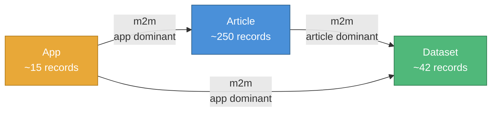

# ResearchHub CMS Migration (Strapi 3 → Strapi 5)

A complete, automated migration tool for converting a legacy Strapi 3 (MongoDB) content management system to a current Strapi 5 (SQLite) instance. Performs a full API-to-API transfer — extracting all content, media, and relations from Strapi 3, transforming and loading them into Strapi 5, then running automated validation and field-by-field parity checks. The end result is a fully migrated, verified Strapi 5 database running on SQLite.

**Project:** ResearchHub Content Migration
**Team:** ICJIA Development Team
**Date:** March 2026
**Version:** 2.7.0 ([Changelog](CHANGELOG.md))

---

## Overview

ResearchHub is ICJIA's platform for publishing research articles, datasets, and data dashboards. This project migrates ResearchHub's content management system from Strapi 3 (MongoDB) to Strapi 5 (SQLite).

Strapi 3 reached end of life in 2022 and no longer receives security patches or compatibility updates. Strapi 5 runs on SQLite, reducing infrastructure complexity and hosting costs while restoring active security and feature support.

## Quick Start: Complete Migration Walkthrough

This walkthrough takes you from zero to a fully migrated Strapi 5 instance. It assumes:
- Strapi 3 is running in production at `https://researchhub.icjia-api.cloud`
- You're testing locally on your Mac before deploying to a production Strapi 5 server
- You have Node.js 18+ and pnpm installed

> **Test locally first.** The entire migration runs on `localhost:1338` — no cloud server needed. The scripts read from the remote Strapi 3 API and write to your local Strapi 5. Run it on your machine, verify it works, browse the admin panel, and check everything looks right. Only then set up a production Strapi 5 instance on a cloud server and run the migration again against the production URL. Testing locally costs nothing and catches issues before they matter.

### Step 0: Install prerequisites

```bash
# Install Node.js 22 (if not already installed)
# Using nvm (recommended):
nvm install 22
nvm use 22

# Install pnpm globally
npm install -g pnpm

# Verify
node --version   # should be v22.x
pnpm --version   # should be 10.x+
```

### Step 1: Clone and install the migration project

```bash
git clone https://github.com/ICJIA/hub-cms-migration-2026.git
cd hub-cms-migration-2026
pnpm install
```

### Step 2: Create a fresh Strapi 5 project

In a **separate directory** (not inside the migration project):

```bash
cd ..
npx create-strapi@latest strapi5-researchhub
```

Answer the prompts:
- TypeScript? **No**
- Install dependencies with npm? **Yes** (npm, not pnpm — native module compatibility)
- Initialize git? Your choice

Then set the port to 1338 (avoids conflict with Strapi 3's default 1337):

```bash
cd strapi5-researchhub
echo "PORT=1338" >> .env
```

Install the GraphQL plugin (needed for Phase 1 verification):

```bash
npm install @strapi/plugin-graphql
```

Start Strapi 5:

```bash
npm run develop
```

Wait for "Welcome back!" then open `http://localhost:1338/admin` and create your admin account.

### Step 3: Create an API token

In the Strapi 5 admin panel:
1. Go to **Settings** → **API Tokens** → **Create new API Token**
2. Name: `migration`
3. Token type: **Full access**
4. Click **Save** and copy the token (shown only once)

### Step 4: Configure the migration project

Back in the migration project directory:

```bash
cd ../hub-cms-migration-2026
cp config.dev.js config.js
```

Set your API token (choose one method):

```bash
# Option A: interactive (recommended — prompts for URL and token)
pnpm set-strapi5

# Option B: edit config.js directly and paste the token into strapi5.token

# Option C: environment variable
export STRAPI5_TOKEN="your-token-here"
```

### Step 5: Run Phase 1 — Schema Setup

```bash
pnpm migrate:phase01
```

This will:
1. Read the Strapi 3 schemas (from local `schemas/` directory + live GraphQL introspection)
2. Generate Strapi 5 `schema.json` files for all 3 content types
3. **Automatically copy** the schemas to your Strapi 5 project
4. Prompt you to restart Strapi 5 (so it picks up the new schemas)
5. Verify the schemas were applied correctly

**After this phase:** Strapi 5 has empty Article, Dataset, and App content types with all the right fields and relations. No data yet.

### Step 6: Run Phase 2 — Data Extraction

```bash
pnpm migrate:phase02
```

This will:
1. Connect to production Strapi 3 via GraphQL
2. Extract all ~246 articles, ~35 datasets, ~14 apps with full field data
3. Save everything as local JSON files in `migration/data/raw/`
4. Verify record counts match Strapi 3's REST count endpoints

**After this phase:** All Strapi 3 data exists locally. Strapi 3 is no longer needed for the remaining phases (though it must be running for Phase 5 and 6 cross-validation).

### Step 7: Run Phase 3 — Base64 Extraction & Media Migration

```bash
pnpm migrate:phase03
```

This is the longest phase. It will:
1. Scan all articles for Base64 images in `splash`, `thumbnail`, and `markdown` fields
2. Scan all apps for Base64 images in the `image` field
3. Decode ~1,000+ Base64 images to binary files
4. Upload all decoded images to Strapi 5's media library
5. Download and re-upload `mainfile`/`extrafile` (articles) and `datafile` (datasets) from Strapi 3
6. Rewrite article `markdown` content to replace Base64 with `/uploads/` URLs
7. Transform all three content types for Strapi 5 loading
8. Verify zero Base64 remnants remain

**After this phase:** All media files are in Strapi 5. All content is transformed and ready to load. `migration/data/transformed/` has the final article, dataset, and app JSON files.

### Step 8: Run Phase 4 — Content Loading & Timestamp Restoration

```bash
pnpm migrate:phase04
```

This will:
1. Load datasets into Strapi 5 (no dependencies)
2. Load apps into Strapi 5 (dominant on 2 relations)
3. Load articles into Strapi 5 (dominant on article↔dataset)
4. Link the relation triangle: article→datasets, app→articles, app→datasets
5. Prompt you to **stop Strapi 5** for the timestamp fix
6. Restore original `createdAt`/`updatedAt` via direct SQLite update
7. Auto-configure "Entry title" so the admin panel shows titles (not IDs) in relation pickers
8. Prompt you to **restart Strapi 5**
9. Verify all records loaded, relations linked, timestamps correct

**After this phase:** Strapi 5 is fully populated with all content, relations, and original timestamps.

### Step 9: Run Phase 5 — Validation

```bash
pnpm migrate:phase05
```

Runs 10 automated checks:
1. Record counts match between Strapi 3 and Strapi 5
2. Every Strapi 3 ID maps to exactly one Strapi 5 record
3. Zero `data:image/` strings in any text field
4. All splash/thumbnail/mainfile/extrafile/app image media relations set
5. All dataset datafile media relations set
6. Every media URL returns HTTP 200
7. All 3 relation sets (article↔dataset, app↔article, app↔dataset) intact
8. All timestamps match originals (±1 second)
9. Random 10% content spot check (title, slug, markdown length)
10. Zero duplicate `legacyId` values

**Expected result:** `10/10 checks passed — MIGRATION VALIDATED ✓`

### Step 10: Run Phase 6 — Parity Audit

```bash
pnpm migrate:phase06
```

Field-by-field comparison of every record. Produces:
- `migration/data/audit-report.json` — structured findings
- `migration/data/audit-report.md` — human-readable report

**Expected result:** `0 ERRORs` with ~1,300 EXPECTED changes (Base64→media, date format, boolean defaults).

### Step 11: Manual QA

Open your Strapi 5 admin panel (`http://localhost:1338/admin`) and spot-check:
- Articles display with splash images and thumbnails
- Inline images render in markdown content
- Relations show titles (not ObjectIds) in the relation picker
- Dataset files are downloadable
- App dashboard links work
- Publication dates are historic (not migration day)

### You're done! (Locally)

Your local Strapi 5 instance at `localhost:1338` is a verified copy of the production Strapi 3 data. Browse the admin panel, check the content, verify relations — everything is real data from the production Strapi 3.

### When ready for production

Once you're satisfied with the local test:

1. Set up a Strapi 5 instance on DigitalOcean (see [Strapi 5 Setup Guide](docs/STRAPI5-SETUP.md))
2. Point the migration at the production URL: `pnpm set-strapi5`
3. Clean and re-run: `pnpm migrate:clean` then `pnpm migrate:phase01` through `pnpm migrate:phase06`
4. If new content was added to Strapi 3 since your local test: `pnpm sync` catches it up

The production run follows the exact same steps — the only difference is the Strapi 5 URL and token in `config.js`.

---

## Migration Checklist

A detailed visual checklist of everything each phase does. Use this to track progress and understand the full migration pipeline.

### Phase 1: Schema Setup (`pnpm migrate:phase01`)

**Introspection (01a):**
- [ ] Connect to Strapi 3 GraphQL at `researchhub.icjia-api.cloud`
- [ ] Run GraphQL introspection query to discover all content types and fields
- [ ] Read local Strapi 3 model files from `schemas/` directory (authoritative source)
- [ ] Merge GraphQL data with model file data into unified schema representation
- [ ] Save introspection results to `migration/data/introspection/strapi3.json`
- [ ] Save parsed model data to `migration/data/introspection/strapi3-models.json`

**Schema Generation (01b):**
- [ ] Read Strapi 3 model data and field type mapping rules
- [ ] Convert each field type: `string` → `string`, `text` → `text`, `json` → `json`, etc.
- [ ] Apply overrides: `article.splash` string → `media`, `article.thumbnail` string → `media`, `app.image` string → `media`
- [ ] Convert upload plugin fields: `mainfile`, `extrafile`, `datafile` → `media` type
- [ ] Convert relations with correct dominance: article↔dataset (article dominant), article↔app (app dominant), app↔dataset (app dominant)
- [ ] Add `legacyId` (string, unique) to every content type for migration traceability
- [ ] Set `draftAndPublish: false` on all content types
- [ ] Put `title` before `legacyId` in attribute order (so admin panel shows titles in relation pickers)
- [ ] Generate CommonJS boilerplate files (routes, controllers, services) for each content type
- [ ] Write schema.json files to `migration/output/strapi5-schemas/`
- [ ] Write field mapping reference to `migration/config/field-map.json`
- [ ] Auto-copy generated schemas to the Strapi 5 project `src/api/` directory

**Verification (01c):**
- [ ] Poll Strapi 5 until it responds (up to 60 seconds)
- [ ] Run GraphQL introspection against Strapi 5
- [ ] Diff Strapi 3 vs Strapi 5 schemas
- [ ] Confirm all 3 content types exist: Article, Dataset, App
- [ ] Confirm all fields present with correct types
- [ ] Confirm `splash`, `thumbnail`, `image` changed from String to media (EXPECTED)
- [ ] Confirm `mainfile`, `extrafile`, `datafile` are media fields
- [ ] Confirm `legacyId` field exists on all 3 types
- [ ] Confirm relation fields are correctly defined (triangle graph)
- [ ] Confirm REST API responds for all content types
- [ ] Save schema diff to `migration/data/introspection/schema-diff.json`

### Phase 2: Data Extraction (`pnpm migrate:phase02`)

**Extraction (02-extract):**
- [ ] Connect to Strapi 3 GraphQL endpoint
- [ ] Extract all articles (~246 records) with paginated queries (100 per page)
  - [ ] All scalar fields: title, status, slug, date, abstract, markdown, funding, citation, doi, etc.
  - [ ] Base64 fields: splash, thumbnail (raw Base64 strings preserved)
  - [ ] JSON fields: categories, tags, authors, images
  - [ ] Media references: mainfile, extrafile (url, name, mime, size, ext)
  - [ ] Relations: datasets (id, title, slug), apps (id, title)
  - [ ] Timestamps: createdAt, updatedAt
- [ ] Extract all datasets (~35 records)
  - [ ] All scalar + JSON fields
  - [ ] Media reference: datafile (url, name, mime, size, ext)
  - [ ] Relations: apps, articles
- [ ] Extract all apps (~14 records)
  - [ ] All scalar fields including Base64 `image`
  - [ ] JSON fields: contributors, categories, tags
  - [ ] Relations: datasets, articles
- [ ] Save to `migration/data/raw/articles.json`, `datasets.json`, `apps.json`
- [ ] Save extraction manifest with counts and metadata
- [ ] Verify counts against Strapi 3 REST count endpoints

**Verification (02-verify):**
- [ ] All 3 JSON files parse successfully
- [ ] Manifest counts match actual file record counts
- [ ] Every record has a valid MongoDB ObjectId (`/^[a-f0-9]{24}$/`)
- [ ] Every record has `createdAt` and `updatedAt` (non-null)
- [ ] No duplicate IDs within any file
- [ ] Article relation arrays (`datasets[]`, `apps[]`) present on all records
- [ ] Article media references (`mainfile`, `extrafile`) well-formed when non-null
- [ ] Dataset `datafile` objects well-formed when non-null
- [ ] Dataset and app relation arrays present
- [ ] App `image` field captured
- [ ] Record counts match Strapi 3 REST endpoints

### Phase 3: Base64 Extraction & Media Migration (`pnpm migrate:phase03`)

**Scan (03a):**
- [ ] Scan all 246 articles for Base64 data:
  - [ ] `splash` field — detect Base64 data URI or raw Base64
  - [ ] `thumbnail` field — same detection
  - [ ] `images` JSON field — log structure for investigation
  - [ ] `markdown` field — regex scan for ``
  - [ ] HTML fallback — scan for `` tags with Base64 src
- [ ] Scan all 14 apps for Base64 in `image` field
- [ ] Generate filenames: `{slug}-splash.{ext}`, `{slug}-thumbnail.{ext}`, `{slug}-{NNN}.{ext}`, `app-{slug}-image.{ext}`
- [ ] Detect MIME types from data URI prefix or magic bytes (PNG, JPEG, GIF, WebP)
- [ ] Save manifest to `migration/data/media/manifest.json`

**Decode (03b):**
- [ ] Read each manifest entry
- [ ] Strip whitespace, newlines, and data URI prefix from Base64 string
- [ ] Decode with `Buffer.from(base64, 'base64')`
- [ ] Validate decoded file: size > 0, magic bytes match MIME type
- [ ] Save to `migration/data/media/files/{filename}`
- [ ] Log failures but continue processing (don't abort)

**Upload (03c):**
- [ ] Upload each decoded file to Strapi 5 `/api/upload` endpoint
- [ ] Check for existing files by name (idempotent — skip if already uploaded)
- [ ] Record mapping in `migration/data/maps/media.json`: filename → strapi5MediaId, strapi5Url
- [ ] Configurable delay between uploads (100ms default)

**Rewrite Articles (03d):**
- [ ] Replace `splash` Base64 → integer Strapi 5 media ID
- [ ] Replace `thumbnail` Base64 → integer Strapi 5 media ID
- [ ] Replace each inline markdown Base64 image → `/uploads/{filename}` URL
- [ ] Replace HTML `` Base64 images
- [ ] Map `id` → `legacyId`
- [ ] Preserve `createdAt` → `_originalCreatedAt`, `updatedAt` → `_originalUpdatedAt`
- [ ] Preserve `_relatedDatasetIds` (article is dominant on article↔dataset)
- [ ] Do NOT include `_relatedAppIds` (article is non-dominant on article↔app)
- [ ] Post-rewrite scan: confirm zero `data:image/` substrings remain
- [ ] Save to `migration/data/transformed/articles.json`

**Transform Datasets, Article Media & Apps (03e):**
- [ ] Download each dataset `datafile` from Strapi 3, re-upload to Strapi 5
- [ ] Download each article `mainfile` from Strapi 3, re-upload to Strapi 5
- [ ] Download each article `extrafile` from Strapi 3, re-upload to Strapi 5
- [ ] Update media IDs in transformed article data
- [ ] Transform datasets: all fields + `legacyId` + timestamps
- [ ] Transform apps: all fields + `legacyId` + timestamps + `_relatedDatasetIds` + `_relatedArticleIds` (app is dominant on both)
- [ ] Replace app `image` Base64 → Strapi 5 media ID
- [ ] Save `migration/data/transformed/datasets.json` and `apps.json`

**Verification (03-verify):**
- [ ] Manifest exists with valid images array
- [ ] No duplicate filenames
- [ ] Decoded file count matches manifest (minus failures)
- [ ] All files > 0 bytes with valid magic bytes
- [ ] Media map has entries for all decoded files
- [ ] All media URLs accessible in Strapi 5 (HTTP 200)
- [ ] Zero `data:image/` substrings in transformed article markdown
- [ ] Splash parity: Base64 count in raw = integer ID count in transformed
- [ ] Thumbnail parity: same
- [ ] App image parity: same
- [ ] Mainfile/extrafile/datafile parity: media ref count matches
- [ ] All records have `legacyId`, `_originalCreatedAt`, `_originalUpdatedAt`
- [ ] No article has `_relatedAppIds`
- [ ] All apps have `_relatedDatasetIds` and `_relatedArticleIds`

### Phase 4: Data Loading & Timestamp Restoration (`pnpm migrate:phase04`)

**Load Content (04-load):**
- [ ] Load datasets first (35 records) — no outbound dominant relations
  - [ ] Check `legacyId` for duplicates before each POST (idempotent)
  - [ ] POST to `/api/datasets` with all fields + `datafile` media ID
  - [ ] Capture `documentId` from response
- [ ] Load apps second (14 records) — dominant on 2 relations
  - [ ] POST to `/api/apps` with all fields + `image` media ID
  - [ ] Relations NOT included yet (linked in next step)
- [ ] Load articles last (246 records) — dominant on article↔dataset
  - [ ] POST to `/api/articles` with all fields + `splash`, `thumbnail`, `mainfile`, `extrafile` media IDs
  - [ ] Relations NOT included yet
- [ ] Save ID maps: `migration/data/maps/articles.json`, `datasets.json`, `apps.json`
- [ ] Save load report: `migration/data/load-report.json`

**Link Relations (04b-link-relations):**
- [ ] Pass 1 — Article → datasets (article is dominant):
  - [ ] For each article with `_relatedDatasetIds`: translate Strapi 3 IDs → Strapi 5 documentIds
  - [ ] PUT `/api/articles/{docId}` with `{ datasets: { connect: [...] } }`
- [ ] Pass 2 — App → articles AND app → datasets (app is dominant for both):
  - [ ] For each app: translate `_relatedArticleIds` and `_relatedDatasetIds`
  - [ ] PUT `/api/apps/{docId}` with `{ articles: { connect: [...] }, datasets: { connect: [...] } }`
- [ ] Warn (don't fail) if a related ID isn't found in the map

**Restore Timestamps (04c-fix-timestamps):**
- [ ] Stop Strapi 5 (prompted by orchestrator)
- [ ] Open SQLite database with `better-sqlite3`
- [ ] Verify actual table names via `sqlite_master` (likely plural: articles, datasets, apps)
- [ ] Verify column names via `PRAGMA table_info` (likely snake_case)
- [ ] For each record: `UPDATE {table} SET created_at=?, updated_at=? WHERE document_id=?`
- [ ] Set "Entry title" to `title` for all content types (admin panel display fix)
- [ ] Sample verification: print 5 records with restored timestamps
- [ ] Close database
- [ ] Restart Strapi 5 (prompted by orchestrator)

**Verification (04-verify):**
- [ ] Record counts match: 246 articles, 35 datasets, 14 apps
- [ ] ID maps complete: every transformed record has a map entry
- [ ] No duplicate `legacyId` values (SQLite query)
- [ ] Every record has a non-null `legacyId`
- [ ] Article → dataset relations correct (sample check)
- [ ] App → article relations correct (sample check)
- [ ] App → dataset relations correct (sample check)
- [ ] All timestamps are historic (predate migration day)
- [ ] Splash, thumbnail, mainfile, extrafile media relations set
- [ ] App image media relations set
- [ ] Dataset datafile media relations set
- [ ] Load report exists

### Phase 5: Validation (`pnpm migrate:phase05`)

**10 Automated Checks (05-validate):**
- [ ] Check 1: Record counts — Strapi 3 REST vs Strapi 5 REST for all 3 types
- [ ] Check 2: Legacy ID coverage — every Strapi 3 `id` maps to exactly one Strapi 5 `legacyId`
- [ ] Check 3: Zero Base64 remnants — scan article `markdown`, `abstract`, app/dataset `description`
- [ ] Check 4: Image/media migration — articles with splash/thumbnail/mainfile/extrafile, apps with image → all have media objects
- [ ] Check 5: Dataset file migration — all datasets with datafile have media relations
- [ ] Check 6: Media accessibility — HEAD request every URL in media.json → HTTP 200
- [ ] Check 7: Relation integrity — all 3 m2m sets match between transformed data and Strapi 5
- [ ] Check 8: Timestamp preservation — SQLite `created_at`/`updated_at` match `_originalCreatedAt`/`_originalUpdatedAt` (±1 second)
- [ ] Check 9: Content integrity — random 10% of articles: title/slug exact match, markdown length plausible
- [ ] Check 10: No duplicates — SQLite `GROUP BY legacyId HAVING COUNT > 1` returns 0 rows
- [ ] Save `migration/data/validation-report.json`
- [ ] Exit 0 if all pass, exit 1 if any fail

### Phase 6: Parity Audit (`pnpm migrate:phase06`)

**Field-by-Field Comparison (06-audit):**
- [ ] Fetch all records from Strapi 3 (GraphQL, paginated)
- [ ] Fetch all records from Strapi 5 (REST, paginated, with populated relations and media)
- [ ] Match records by Strapi 3 `id` ↔ Strapi 5 `legacyId`
- [ ] Schema-level comparison: field names, types, additions, removals
- [ ] For EVERY record, compare:
  - [ ] Scalar fields: title, status, slug, abstract, funding, citation, doi, url, unit, etc. → exact match or ERROR
  - [ ] Date fields: DateTime format → Date format → EXPECTED
  - [ ] Boolean fields: null → false → EXPECTED (Strapi 5 default)
  - [ ] JSON fields: categories, tags, authors, contributors, sources, notes, variables, timeperiod, images → deep-equal
  - [ ] Markdown field: strip image refs from both, compare remaining text → identical = EXPECTED, different = ERROR
  - [ ] Base64→media fields: splash, thumbnail, image → was Base64, now media object = EXPECTED
  - [ ] Upload-plugin fields: mainfile, extrafile, datafile → was media ref, now media object = EXPECTED
  - [ ] Timestamps: createdAt/updatedAt → ±1 second tolerance
  - [ ] Relations: compare related record sets by legacyId → exact match or ERROR
- [ ] Media audit: HEAD request all media URLs, count Base64→media conversions
- [ ] Categorize every finding: ERROR / EXPECTED / INFO / OK
- [ ] Save `migration/data/audit-report.json` (structured, per-record)
- [ ] Save `migration/data/audit-report.md` (human-readable for stakeholders)
- [ ] Exit 0 if zero ERRORs, exit 1 if any ERRORs

### Post-Migration

- [ ] Manual QA: browse Strapi 5 admin panel, spot-check articles/images/relations
- [ ] Share `audit-report.md` with stakeholders for sign-off
- [ ] Back up Strapi 5 SQLite database
- [ ] If needed: `pnpm sync` to catch up any new Strapi 3 content before cutover
- [ ] Switch frontend to Strapi 5 API
- [ ] Monitor for issues during confidence period

---

## Migration Approach

We use an **API-to-API transfer** rather than direct database conversion:

1. **Read** all content from Strapi 3 via its GraphQL API
2. **Transform** content to match Strapi 5's format, including extracting Base64-encoded images from article and app fields into proper media library files
3. **Write** transformed content into Strapi 5 via its REST API
4. **Verify** completeness and correctness with automated gate checks at every phase

## Content Scope

| Content Type | Count | Complexity | Key Challenges |
|---|---|---|---|
| Articles | ~250 | High | `splash` + `thumbnail` (Base64), inline images in `markdown`, `mainfile`/`extrafile` (upload plugin), 2 m2m relations |
| Datasets | ~42 | Medium | `datafile` (upload plugin), multiple JSON metadata fields, 2 non-dominant m2m relations |
| Apps (Dashboards) | ~15 | Medium | `image` (Base64), 2 dominant m2m relations to articles and datasets |

### Relation Graph

All three content types are interconnected in a triangle:



> **Dominant side** owns the join table and is responsible for linking relations during Phase 4. Arrows point from dominant → non-dominant.

## Project Phases

| Phase | Description | Est. Effort |
|---|---|---|
| 1. Schema Setup | Introspect Strapi 3 schema, generate Strapi 5 content types | 1–2 days |
| 2. Data Extraction | Pull all content from Strapi 3 into local JSON files | 1 day |
| 3. Image & Media Migration | Extract Base64 images, upload media files, rewrite references | 2–3 days |
| 4. Content Loading | Load transformed content into Strapi 5, link relations, restore timestamps | 1–2 days |
| 5. Validation | Automated pass/fail verification of migration completeness | 1–2 days |
| 6. Parity Audit | Field-by-field comparison of every record in Strapi 3 vs Strapi 5 | 1 day |

**Total estimated effort:** 8–12 working days (single developer, sequential phases).

## Documentation

Detailed documentation for every aspect of this migration is available in the [`docs/`](docs/) directory:

- **Executive Summary** — High-level overview for project stakeholders and management: [Markdown](docs/researchhub-migration-executive-summary.md) | [Word (.docx)](https://github.com/ICJIA/hub-cms-migration-2026/raw/main/docs/researchhub-migration-executive-summary.docx)
- **[Doc 00 — Master Design](docs/researchhub-migration-doc00.md)** — Full technical architecture: API-to-API approach, data model mapping, Base64 extraction strategy, relation triangle, and end-to-end migration pipeline
- **[Doc 01 — Phase 1: Introspection & Schema Generation](docs/researchhub-migration-doc01.md)** — Strapi 3 schema discovery and Strapi 5 content type generation
- **[Doc 02 — Phase 2: Data Extraction](docs/researchhub-migration-doc02.md)** — GraphQL-based content extraction to local JSON files
- **[Doc 03 — Phase 3: Base64 Extraction & Media Migration](docs/researchhub-migration-doc03.md)** — Image decoding, media library upload, and content rewriting
- **[Doc 04 — Phase 4: Data Loading & Timestamp Restoration](docs/researchhub-migration-doc04.md)** — Content loading via REST API, relation triangle linking, and timestamp correction
- **[Doc 05 — Phase 5: Validation & Reconciliation](docs/researchhub-migration-doc05.md)** — Automated verification checks and migration integrity report
- **[Doc 06 — Phase 6: Parity Audit](docs/researchhub-migration-doc06.md)** — Field-by-field comparison of every record; detailed audit report with ERROR/EXPECTED/INFO categories
- **[Strapi 5 Setup Guide](docs/STRAPI5-SETUP.md)** — Fresh Strapi 5 installation, PM2 + Nginx configuration, Laravel Forge deployment

### Strapi 3 Schemas

The actual Strapi 3 model schemas are stored in [`schemas/`](schemas/) for reference:

- [`article.settings.json`](schemas/article.settings.json) — 16 scalar fields, 2 upload-plugin media fields, 2 m2m relations
- [`dataset.settings.json`](schemas/dataset.settings.json) — 14 scalar fields, 1 upload-plugin media field, 2 m2m relations
- [`app.settings.json`](schemas/app.settings.json) — 12 scalar fields, 2 m2m relations (both dominant)

## Getting Started

### Platform Support

| Platform | Status | Notes |
|---|---|---|
| **macOS** | Supported | Primary development platform. Tested on macOS Tahoe (Darwin 25.x). |
| **Linux** | Supported | Ubuntu preferred. Any distro with Node.js 18+ and pnpm should work. |
| **Windows** | WSL2 required | Native Windows is not supported. Install [WSL2](https://learn.microsoft.com/en-us/windows/wsl/install) with Ubuntu and run the migration from the Linux environment. |

### Prerequisites

- Node.js 18+ (see `.nvmrc` — project targets Node 22)
- pnpm (`npm install -g pnpm` if not already installed)
- A fresh Strapi 5 project (`npx create-strapi@latest`) — use **npm** (not pnpm) for the Strapi 5 install due to native module compatibility. See [Strapi 5 Setup Guide](docs/STRAPI5-SETUP.md).
- `@strapi/plugin-graphql` installed in the Strapi 5 project (for schema verification)

### Configuration

All scripts read from a single config file at the project root. Two profiles are provided:

| Profile | Strapi 3 | Strapi 5 | Use case |
|---|---|---|---|
| `config.dev.js` | `researchhub.icjia-api.cloud` (remote) | `localhost:1338` (local Mac) | Development testing |
| `config.prod.js` | `researchhub.icjia-api.cloud` (remote) | `researchhub2.icjia-api.cloud` (remote DO) | Production migration |

**Quick start:**

```bash
pnpm install

# For local dev testing:
cp config.dev.js config.js

# For production migration:
cp config.prod.js config.js
```

**Or use `MIGRATION_ENV` without copying:**

```bash
MIGRATION_ENV=dev pnpm migrate:phase01
MIGRATION_ENV=prod pnpm migrate:phase02
```

**API tokens:** Set via environment variables or directly in `config.js`:

```bash
export STRAPI5_TOKEN="your-token-here"
```

**Or use the interactive config script to set the Strapi 5 URL and token:**

```bash
pnpm set-strapi5
```

This prompts for the URL and token, updates `config.js`, and tests connectivity.

Every script prints its configuration at startup so you can verify target URLs before it runs. See [`config.example.js`](config.example.js) for all available settings.

> **Security:** `config.js` is gitignored because it may contain API tokens. Never commit it. The `config.dev.js` and `config.prod.js` profile files are committed but use `process.env` for tokens.

### Resetting Migration Data

To wipe all generated migration data and start fresh:

```bash
pnpm migrate:clean
```

This removes `migration/data/`, `migration/output/`, and the generated field map. Scripts, libraries, static config, and source schemas are preserved.

### Starting Over Completely (Fresh Strapi 5)

If you need to re-run the entire migration from scratch (e.g., after fixing a script, testing changes, or doing a dry run before production), you can reset both the migration data and the Strapi 5 database:

```bash
# 1. Stop Strapi 5 (Ctrl+C in its terminal)

# 2. Delete the Strapi 5 database (it will be recreated on next start)
rm /path/to/strapi5-project/.tmp/data.db

# 3. Clean migration data
pnpm migrate:clean

# 4. Restart Strapi 5 — it recreates the DB from the existing schema files
cd /path/to/strapi5-project && npm run develop

# 5. Create a new admin user at http://localhost:1338/admin

# 6. Create a new Full Access API token (Settings → API Tokens)
#    Update config.js with the new token

# 7. Run all phases again
pnpm migrate:phase01
pnpm migrate:phase02
pnpm migrate:phase03
pnpm migrate:phase04
pnpm migrate:phase05
pnpm migrate:phase06
```

> **This is safe and expected.** The migration is designed to be re-runnable. Deleting the Strapi 5 database gives you a clean slate — the schema files in `src/api/` remain intact so Strapi 5 recreates the correct tables automatically. You do NOT need a new Strapi 5 project.

> **Why re-run?** Common reasons include: testing the migration end-to-end before production, verifying a bug fix in a script, or doing a practice run. The Phase 5 validation and Phase 6 audit confirm everything is correct after each run.

### Phase 1: Schema Setup

Generates Strapi 5 content type schemas from the Strapi 3 model definitions. See [`migration/scripts/README.md`](migration/scripts/README.md) for detailed script documentation.

**Recommended — run the interactive orchestrator:**

```bash
pnpm migrate:phase01
```

This walks you through all steps with prompts, explains what's needed at each stage, and gives clear recovery instructions if anything fails. You can pause and resume at any point.

**Or run each step individually:**

```bash
# Step 1: Read Strapi 3 schemas (works without Strapi 3 running — uses local files)
node migration/scripts/01a-introspect.js

# Step 2: Generate Strapi 5 schema.json files + boilerplate
node migration/scripts/01b-generate-schemas.js

# Step 3: Copy generated schemas to your Strapi 5 project
cp -r migration/output/strapi5-schemas/* /path/to/strapi5-project/src/api/

# Step 4: Start Strapi 5 in dev mode (it reads schemas and creates tables)
cd /path/to/strapi5-project && npm run develop

# Step 5: Verify schemas were applied correctly (Strapi 5 must be running)
node migration/scripts/01c-verify-schemas.js
```

**What gets generated:**
- 3 `schema.json` files with all fields, relations (triangle), and `legacyId`
- Route, controller, and service boilerplate for each content type
- Field mapping reference at `migration/config/field-map.json`

### Phase 2: Data Extraction

Pulls all content from Strapi 3 via paginated GraphQL queries and stores it as local JSON files. After this phase, Strapi 3 is no longer needed — all data exists locally.

**Recommended — run the interactive orchestrator:**

```bash
pnpm migrate:phase02
```

**Or run each step individually:**

```bash
node migration/scripts/02-extract.js    # extract all content types
node migration/scripts/02-verify.js     # verify counts and data integrity
```

**What it produces:** `migration/data/raw/articles.json`, `datasets.json`, `apps.json`, and an extraction manifest. See [Doc 02](docs/researchhub-migration-doc02.md) for details.

> **Note:** All generated data in `migration/data/` and `migration/output/` is gitignored. It stays on the developer's local machine only.

### Phase 3: Base64 Extraction & Media Migration

Extracts Base64 images from article `splash`/`thumbnail`/`markdown` and app `image` fields, decodes them to files, uploads to Strapi 5's media library, and rewrites content references. Also downloads and re-uploads `mainfile`/`extrafile`/`datafile` media.

**Recommended — run the interactive orchestrator:**

```bash
pnpm migrate:phase03
```

**Or run each step individually:**

```bash
node migration/scripts/03a-scan-base64.js       # scan for Base64 images, produce manifest
node migration/scripts/03b-decode-base64.js      # decode to binary files
node migration/scripts/03c-upload-media.js       # upload to Strapi 5 media library
node migration/scripts/03d-rewrite-content.js    # replace Base64 with media URLs in articles
node migration/scripts/03e-transform.js          # transform datasets + apps, migrate upload-plugin files
node migration/scripts/03-verify.js              # verify zero Base64 remnants, all media accessible
```

**What it produces:** decoded images in `migration/data/media/`, media ID map in `migration/data/maps/media.json`, and transformed content in `migration/data/transformed/`. See [Doc 03](docs/researchhub-migration-doc03.md) for details.

### Phase 4: Data Loading & Timestamp Restoration

Loads all transformed content into Strapi 5 via REST API in dependency order (datasets → apps → articles), links the m2m relation triangle, and restores original `createdAt`/`updatedAt` timestamps via direct SQLite updates.

**Recommended — run the interactive orchestrator:**

```bash
pnpm migrate:phase04
```

**Or run each step individually:**

```bash
node migration/scripts/04-load.js               # load content: datasets → apps → articles
node migration/scripts/04b-link-relations.js     # link relation triangle from dominant sides
node migration/scripts/04c-fix-timestamps.js     # restore original timestamps (stop Strapi 5 first!)
node migration/scripts/04-verify.js              # verify counts, relations, timestamps
```

**What it produces:** fully populated Strapi 5 with all content, relations, and correct timestamps. ID maps in `migration/data/maps/`. See [Doc 04](docs/researchhub-migration-doc04.md) for details.

### Phase 5: Validation & Reconciliation

Runs 10 automated checks comparing Strapi 3 and Strapi 5 end-to-end: record counts, legacy ID coverage, zero Base64 remnants, media accessibility, relation integrity (all three m2m sets), timestamp preservation, content integrity spot checks, and duplicate detection.

**Recommended — run the interactive orchestrator:**

```bash
pnpm migrate:phase05
```

**Or run directly:**

```bash
node migration/scripts/05-validate.js           # run all 10 validation checks
```

**What it produces:** `migration/data/validation-report.json` with pass/fail per check and a console summary. See [Doc 05](docs/researchhub-migration-doc05.md) for details.

### Phase 6: Parity Audit

A comprehensive, field-by-field comparison of every record in Strapi 3 vs Strapi 5. Unlike Phase 5 (pass/fail), Phase 6 categorizes every difference as **ERROR** (unexpected), **EXPECTED** (intentional, like Base64 → media), or **INFO** (worth noting). Produces a detailed audit report for stakeholder sign-off.

**Recommended — run the interactive orchestrator:**

```bash
pnpm migrate:phase06
```

**Or run directly:**

```bash
node migration/scripts/06-audit.js    # or: pnpm audit
```

**What it produces:**
- `migration/data/audit-report.json` — structured per-record findings
- `migration/data/audit-report.md` — human-readable report for stakeholders

See [Doc 06](docs/researchhub-migration-doc06.md) for details.

### Setting Up Strapi 5

For detailed instructions on installing a fresh Strapi 5 instance, configuring PM2, Nginx, and Laravel Forge, see the **[Strapi 5 Setup Guide](docs/STRAPI5-SETUP.md)**.

### Incremental Sync (Catching Up After Initial Migration)

If new content is added to Strapi 3 after the initial migration (e.g., new articles published while Strapi 5 is in dev), run the sync script to catch up without re-doing the full migration:

```bash
pnpm sync
```

This single script:
1. Compares all records in Strapi 3 vs Strapi 5 (by `legacyId`)
2. **NEW records** — automatically extracts, transforms, uploads media, loads into Strapi 5, and links relations
3. **UPDATED records** — flags for manual review (does not auto-overwrite)
4. **DELETED records** — flags records in Strapi 5 that no longer exist in Strapi 3

Safe to run multiple times. Saves a sync report to `migration/data/maps/sync-report.json`.

## Risks and Mitigations

| Risk | Impact | Mitigation | Phase |
|---|---|---|---|
| **Image extraction misses some images** — articles display with broken images or leftover Base64 data | High | Automated regex scanning catches all Base64 patterns (markdown + HTML fallback); post-rewrite scan confirms zero remnants; Phase 5 validates end-to-end | 3, 5 |
| **Content corrupted during transfer** — article text, titles, or descriptions garbled or truncated | High | Content is never modified in place — original data preserved as `data/raw/`. Automated field-by-field comparison between source and target catches discrepancies | 2, 5 |
| **Timestamps overwritten** — all records appear created on migration day, destroying the publication timeline | High | Original `createdAt`/`updatedAt` captured during extraction and restored via direct SQLite update after API loading | 2, 4 |
| **Migration fails partway through** — some content loaded, some not, leaving Strapi 5 inconsistent | Medium | Every script is idempotent: `legacyId` duplicate detection means re-running skips already-loaded records and picks up where it left off | 4 |
| **Relation triangle broken** — articles lose connections to datasets and/or apps | Medium | Relations linked in a dedicated step from the dominant side; all three m2m sets verified by automated checks | 4, 5 |
| **Media files fail to transfer** — datasets link to missing Excel files, articles to missing PDFs | Medium | Each file download and re-upload verified individually; failures logged with record IDs for targeted re-run or manual resolution | 3 |
| **Schema generation produces invalid types** — Strapi 5 won't start | Medium | Automated schema diff (Phase 1c) catches field mismatches before any data is loaded; manual admin panel review as gate check | 1 |
| **`thumbnail`/`image` fields may not contain Base64** — wrong field type in Strapi 5 schema | Medium | Phase 2 extraction captures raw field values; Phase 3 scan investigates actual contents before processing | 2, 3 |

For the full risk register with detailed recovery procedures, see [Doc 00 — Master Design, Section 7](docs/researchhub-migration-doc00.md).

## Success Criteria

1. All records transferred (matching counts between source and target)
2. All Base64 images extracted (`splash`, `thumbnail`, `image`) and stored as media library files
3. All upload-plugin files migrated (`mainfile`, `extrafile`, `datafile`)
4. All relationships preserved (article↔dataset, article↔app, app↔dataset)
5. All original `createdAt`/`updatedAt` timestamps preserved
6. Zero Base64 remnants in any text field
7. No duplicate records
8. ResearchHub website functions correctly with the new backend

## License

[MIT License](LICENSE) - Copyright (c) 2026 Illinois Criminal Justice Information Authority (ICJIA)
